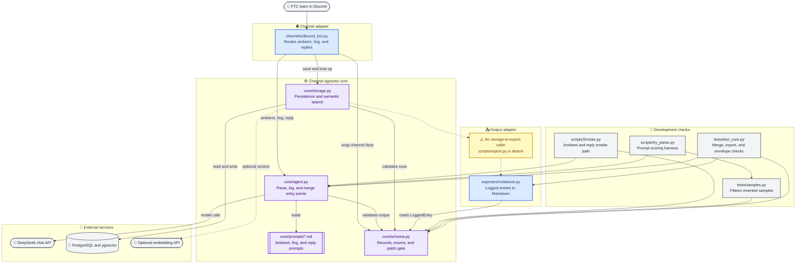

# DiscordFTCAgent codebase structure

*Current implementation snapshot as of August 31, 2026; architectural boundaries follow `CLAUDE.md`.*

---

## 🗂️ Current structure

## 📌 Boundary notes

- `channels/discord_bot.py` owns Discord-specific input and output, while decisions stay in `core/`
- `core/agent.py` is the only module that knows the chat-model provider; `core/storage.py` alone owns PostgreSQL, pgvector, and the optional embedding provider
- `exporters/notebook.py` is a pure transform and does not query storage
- The export pipeline is not connected in the current tree because `scripts/export.py` has not been implemented
- `tests/samples.py` exists, but its own header identifies the messages as invented rather than real team data
